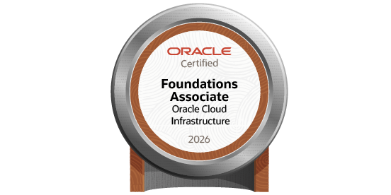

<div align="center">


<a href="https://cursos.alura.com.br/user/dbz10ssj5">
  
</a>

<br>

<a href="https://github.com/douglasn5">
  
</a>
<a href="mailto:douglasn5.dev@gmail.com">
  
</a>


</div>

<br>

## 👨‍💻 Sobre mim

Sou um desenvolvedor em formação, apaixonado por tecnologia e por transformar problemas em soluções através do código.

Estou constantemente estudando, praticando e desenvolvendo projetos para aprimorar minhas habilidades em programação, desenvolvimento web, dados, inteligência artificial e computação em nuvem.

Atualmente meu foco é continuar construindo uma base sólida como desenvolvedor e expandir meus conhecimentos através de projetos práticos e experiências reais.

---

### 🎓 Formação

- **Análise e Desenvolvimento de Sistemas** *(em andamento)*

---

### 🎯 Áreas de interesse

- Cloud Computing (Oracle Cloud Infrastructure)
- Desenvolvimento Web & Back-end
- Inteligência Artificial Generativa
- Suporte técnico N1/N2, Redes e Active Directory

---


## 🛠️ Tecnologias & Ferramentas

<div align="center">

**Linguagens**


<br><br>

**Dados & Banco de Dados**


<br><br>

**Ferramentas**


<br><br>

**Cloud & Outros**


</div>

---

## 🌟 Projetos em destaque

> **[EnergiAI](https://github.com/douglasn5/EnergiAI)**
> Projeto voltado à utilização de Inteligência Artificial e análise de dados aplicada ao consumo de energia elétrica.

> **[appsaude](https://github.com/douglasn5/appsaude)**
> Aplicativo Ionic voltado à área de saúde, com foco em aplicação prática e gerenciamento de informações (vacinas contra Covid).

> **[Amigo Secreto](https://github.com/douglasn5)**
> Aplicação para realizar sorteios de Amigo Secreto de forma simples e prática.

> **[Sistema de Estoque](https://github.com/douglasn5)**
> Sistema de gerenciamento e controle de produtos em Python, trabalhando conceitos de CRUD e banco de dados.

---

## 🏆 Certificações

<div align="center">

<table>
<tr>

<td align="center" width="25%">

<br>

**Oracle Cloud Infrastructure**
**Foundations Associate**

*Emitido em 26/06/2026*

<br>

<a href="https://catalog-education.oracle.com/ords/certview/sharebadge?id=685FDFE1CEAFC400DE41966FA1511E4C028A2DB255A5CD3AF8C489C81C44ED26">

</a>

</td>

<td align="center" width="25%">

☁️ **Oracle One / Alura**

**Lógica de Programação**
Mergulhe em programação com JavaScript

*Concluído em 28/07/2025*

<br><br>

<a href="https://cursos.alura.com.br/user/dbz10ssj5/course/logica-programacao-mergulhe-programacao-javascript/certificate">

</a>

</td>

<td align="center" width="25%">

📡 **Oracle One / Alura**

**Challenge Telecom X**
Análise de evasão de clientes – Parte 2

*Concluído em 09/03/2026*

<br><br>

<a href="https://cursos.alura.com.br/user/dbz10ssj5/course/challenge-telecom-x/certificate">

</a>

</td>

<td align="center" width="25%">

🤖 **Oracle One / Alura**

**IA: Explorando o Potencial**
da Inteligência Artificial Generativa

*Concluído em 08/08/2025*

<br><br>

<a href="https://cursos.alura.com.br/user/dbz10ssj5/course/ia-explorando-potencial-inteligencia-artificial-generativa/certificate">

</a>

</td>

</tr>
</table>

</div>

---

## 📊 Estatísticas do GitHub

<div align="center">


<br>


</div>

---

## 📈 Minha atividade

<div align="center">


</div>

---

## 👻 Pac-Man está com fome...

<div align="center">

<!-- pacman -->
<picture>
    <source media="(prefers-color-scheme: dark)" srcset="https://raw.githubusercontent.com/douglasn5/douglasn5/output/pacman-contribution-graph-dark.svg">
    <source media="(prefers-color-scheme: light)" srcset="https://raw.githubusercontent.com/douglasn5/douglasn5/output/pacman-contribution-graph.svg">
    
</picture>

*(a imagem só aparece depois que o GitHub Action rodar pela 1ª vez — veja as instruções que te mandei junto com este README)*

</div>

---

## 📚 Minha jornada

```text
┌─────────────────────────┐
│       APRENDER          │
└────────────┬────────────┘
             │
             ▼
┌─────────────────────────┐
│       PRATICAR          │
└────────────┬────────────┘
             │
             ▼
┌─────────────────────────┐
│       CONSTRUIR         │
└────────────┬────────────┘
             │
             ▼
┌─────────────────────────┐
│       EVOLUIR           │
└────────────┬────────────┘
             │
             └───────────────┐
                             │
                             ▼
                      🔄 REPETIR
```

---

<div align="center">

**Estou sempre aberto para colaborações, networking e novas oportunidades!**


</div>
